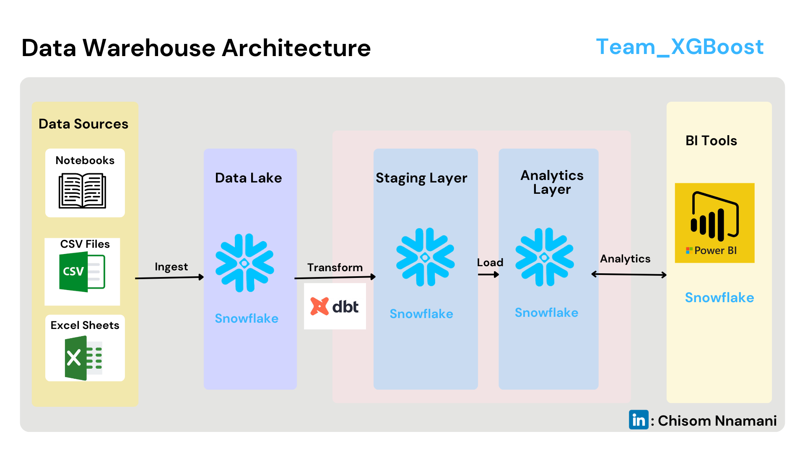

# School Data Warehouse Project Documentation

## Project Overview

### Background

FGC Ilorin recently experienced concerning statistics in their 2024 WASSCE results. Only **56.78%** of their students achieved five credits or more, including passes in Mathematics and English. Recognizing this, the school consulted us to dive deep into the issue and create a data-driven solution to improve students' academic performance. 

Find the statistics [here](https://media.premiumtimesng.com/wp-content/files/2016/08/RESULT-STATISTICS-FOR-MAY-JUNE-2015-WASSCE-SUMMARY-FOR-FEDERAL-UNITY-SCHOOLS.pdf)

With the upcoming JAMB and WASSCE exams, our objective was to not only analyze the factors influencing poor performance but also to proactively provide insights that would lead to a better result in the future. We designed and implemented an end-to-end solution to help the school leverage data to improve performance in these crucial examinations.

## How We Carried Out the Project
### 1. Data Generation
Since the school lacked a foundational data infrastructure, we simulated a dataset that reflects the key aspects of the African educational ecosystem. The data generation plan was carried out using a Python script (`data_generation.py` and `academic_performance.py`) to simulate realistic data for the various entities in the system.

- **Student bio-data** (e.g., age, gender, admission number)
- **Parents’ demographic data** (e.g., income level, occupation, education level)
- **Resource allocation** (e.g., library usage, lab usuage)
- **Extra-curricular activities** (e.g., clubs and sports participation)
- **Historical exam performance** (e.g., exam scores)
- **Staff Bio-data** (e.g., exam scores)
---

## Data Warehouse Design

The data warehouse is structured into **dimension tables** and **fact tables**, following a star schema for efficient querying and reporting. The primary dimensions store descriptive information about the entities, while the fact tables capture transactional data that tracks events like attendance, academic performance, and resource usage.

---

## Dimension Tables

### `DimStudent`
Stores all student-related information and demographics. This is mapped to a Snowflake Database Schema.

| Column Name       | Data Type    | Description                        | Example          | Constraints/Notes                                    |
|-------------------|--------------|------------------------------------|------------------|-----------------------------------------------------|
| `student_id`       | INT          | Unique identifier for each student | 1001             | Primary Key, Auto-increment                         |
| `admission_number` | VARCHAR(20)  | School-assigned ID number          | JSS/2020/001     | Unique, Not Null, Format: [Level]/[Year]/[Sequence] |
| `full_name`        | VARCHAR(100) | Student's full name                | Chidi Okafor     | Not Null                                            |
| `date_of_birth`    | DATE         | Student's birth date               | 2007-05-15       | Not Null                                            |
| `gender`           | VARCHAR(10)  | Student's gender                   | Male, Female     | Not Null, Check constraint: IN ('Male', 'Female')   |
| `join_date`        | DATE         | Date student joined the school     | 2020-09-15       | Not Null                                            |
| `join_class`       | VARCHAR(10)  | Class student joined in            | JSS1             | Not Null                                            |
| `current_class`    | VARCHAR(10)  | Student's current class            | SSS3             | Not Null                                            |
| `state_of_origin`  | VARCHAR(50)  | Student's state of origin          | Lagos            | Not Null                                            |
| `religion`         | VARCHAR(30)  | Student's religious affiliation    | Christianity     | Nullable                                            |
| `stream`           | VARCHAR(20)  | Academic stream                    | Science, Arts    | Null for junior students                            |
| `boarding_status`  | VARCHAR(20)  | Boarding status                    | Day Student      | Not Null                                            |
| `scholarship_type` | VARCHAR(50)  | Type of scholarship                | Government       | Default 'None'                                      |
| `local_language`   | VARCHAR(50)  | Primary local language             | Yoruba           | Nullable                                            |
| `health_information`| TEXT        | Health information                 | Asthmatic        | Encrypted field, Nullable                           |
| `previous_school`  | VARCHAR(100) | Previous school attended           | Unity Primary    |                                                     |
| `distance_to_school_km`| FLOAT    | Distance to school in km           | 3.5              | Used for transportation planning                    |
| `transport_mode`   | VARCHAR(30)  | Mode of transport                  | Walking, Public  |                                                     |

---

### `DimStaff`
Contains data about staff members, including both teaching and non-teaching staff.

| Column Name       | Data Type    | Description                  | Example                  | Constraints/Notes                      |
|-------------------|--------------|------------------------------|--------------------------|---------------------------------------|
| `staff_id`        | INT          | Unique identifier for staff   | 201                      | Primary Key                           |
| `email`           | VARCHAR(20)  | School-assigned staff email  | name@fgcilorin.edu.ng      | Unique, Not Null                      |
| `full_name`       | VARCHAR(100) | Staff member's full name      | Mrs. Oluwaseun Adeleke    | Not Null                              |
| `role_type`       | VARCHAR(20)  | Teaching or Non-Teaching      | Teaching                  | Not Null                              |
| `job_title`       | VARCHAR(50)  | Specific job title            | Teacher                   | Not Null                              |
| `qualification`   | VARCHAR(50)  | Educational qualification     | B.Ed                      | Not Null                              |
| `subjects_taught` | VARCHAR(200) | Subjects taught               | Mathematics, Physics      | Nullable (for non-teaching staff)     |
| `years_experience`| INT          | Years of experience           | 8                         | Not Null                              |
| `date_joined`     | DATE         | Start date                    | 2018-09-01                | Not Null                              |
| `is active`       | BOOLEAN    | Staff is with the school        | Yes or No         | Not Null                              |

---

### `DimFamily`
Captures family background and socioeconomic data.

| Column Name           | Data Type    | Description                  | Example                  | Constraints/Notes                  |
|-----------------------|--------------|------------------------------|--------------------------|-----------------------------------|
| `family_id`           | INT          | Unique identifier for family  | 5001                      | Primary Key                       |
| `socioeconomic_status`| VARCHAR(20)  | Family's economic status      | Middle                    | Not Null                          |
| `parent_education_level`| VARCHAR(50)| Parent's highest education    | Tertiary                  |                                   |
| `number_of_siblings`  | INT          | Number of siblings            | 3                         |                                   |
| `family_structure`    | VARCHAR(30)  | Family structure              | Both parents              | Not Null                          |

---

## Fact Tables

### `ExtraCurricularActivities`

The `ExtraCurricularActivities` table stores data about the various extracurricular activities that students participate in.

| Column Name       | Data Type  | Description                                                                                       |
|-------------------|------------|---------------------------------------------------------------------------------------------------|
| extracurricular_id| INT        | A unique identifier for each extracurricular activity record.                                      |
| student_id        | INT        | Foreign key linking to the student in the `Students` table.                                        |
| activity_name     | VARCHAR    | The name of the extracurricular activity (e.g., Sports, Music, Drama).                            |
| activity_date     | DATE       | The date the extracurricular activity took place.                                                 |
| duration_minutes  | INT        | The duration of the extracurricular activity in minutes.                                          |
| instructor        | VARCHAR    | The name of the instructor responsible for overseeing the activity.                               |

---

### `FactPerformance`

The `FactAcademicPerformance` table stores data about students' performance in various subjects across different academic years and classes.

| Column Name      | Data Type  | Description                                                                                       |
|------------------|------------|---------------------------------------------------------------------------------------------------|
| performance_id   | INT        | A unique identifier for each academic performance record.                                          |
| student_id       | INT        | Foreign key linking to the student in the `Students` table.                                        |
| year             | YEAR       | The academic year the performance data is associated with.                                         |
| class_name       | VARCHAR    | The name of the class the student was in (e.g., SS1, SS2, SS3).                                    |
| subject          | VARCHAR    | The subject in which the student was evaluated (e.g., Mathematics, English).                      |
| total_score      | DECIMAL    | The total score the student achieved in the subject.                                               |
| teacher_id       | INT        | Foreign key linking to the teacher responsible for the subject in the `Teachers` table.            |
| family_id        | INT        | Foreign key linking to the student's family information in the `Families` table.                   |
| total_attendance | INT        | The total number of days the student attended the class during the academic year.                  |
| score_range      | VARCHAR    | The range within which the student's total score falls (e.g., 0-49, 50-69, 70-100).               |

---

## ResourceUsage Table

The `ResourceUsage` table tracks how students utilize school resources, such as libraries, labs, or study halls.

| Column Name      | Data Type  | Description                                                                                       |
|------------------|------------|---------------------------------------------------------------------------------------------------|
| usage_id         | INT        | A unique identifier for each resource usage record.                                                |
| student_id       | INT        | Foreign key linking to the student in the `Students` table.                                        |
| resource_name    | VARCHAR    | The name of the resource used (e.g., Library, Computer Lab).                                       |
| usage_date       | DATE       | The date when the resource was used.                                                               |
| start_time       | TIME       | The start time when the resource usage began.                                                      |
| duration_minutes | INT        | The duration in minutes the resource was used for.                                                 |
| purpose          | VARCHAR    | The purpose for which the resource was used (e.g., Study, Research, Recreation).                   |
| supervised_by    | VARCHAR    | The name of the person supervising the resource usage (e.g., Librarian, Teacher).                  |

---
## Data Modeling Overview

In this project, we designed a data model that organizes the school's data into relevant tables, ensuring efficient storage, retrieval, and analysis. The model includes tables for student performance, extracurricular activities, and resource usage, among others. Each table has carefully defined relationships, enabling a comprehensive view of each student's academic journey and resource engagement.

The diagram below illustrates the structure of our data model (mapping it to snowflake schema) and highlighting the relationships between key entities:

<b>Data Modeling Diagram</b>

  

As shown, we establish foreign key relationships between fact and dim tables like `FactAcademicPerformance`, `ExtraCurricularActivities`, and `ResourceUsage`, ensuring data consistency and supporting powerful cross-table queries for insights.

---
## Data Warehouse Architecture
With the insights from the data modeling process, we go ahead to develop the data warehouse architecture, which depicts to the stakeholders, how the data flows from the source to the data warehouse in snowflake.

<b>Data Warehouse Architecture Diagram</b>

  

---
## Data Storage, Transformation, and  Integration with DBT and Snowflake
This project leverages *DBT (Data Build Tool)* for data transformation and *Snowflake* for data storage and integration, ensuring a robust and scalable data pipeline.

### Data Storage with Snowflake
After the raw data was provided to the team, and as recommended to the stakeholders, Snowflake was utilized as the cloud-based data warehouse for secure and scalable data storage.

___Why did we choose snowflake___
- It is cost effective
- It allows for efficient querying and processing of large datasets, ensuring high performance and flexibility. 
- To achieve a central repository for the school's data management and analytics, where all raw and processed data are stored.

### Data Transformation and integration with DBT
DBT is used to transform the raw data stored in Snowflake into a structured and usable format.

DBT allows for defining transformation models in SQL, ensuring that data is cleaned, aggregated, and structured according to the business logic. The transformation process includes:

- Data Cleansing: Removing duplicates, null values, and other inconsistencies in the raw data.

- Data Aggregation: Combining and summarizing data from multiple tables to produce meaningful insights.

- Data Structuring: Organizing the data into layers that are optimized for analytics and reporting. Two layers were creted with dbt during this stage ans they are:

    - Staging Layer:This is where the data transformation was done. The `dbt_sec_school_schema_staging` schema is our snowflake database is the staging layer that holds all the transformed data(tables) and which are all identified by the **prefix `stg`.**

    - Analytical Layer:Analytical Layer: This is the final layer that supports analytics and reporting. The transformed data from the staging layer is further refined and organized into models that are optimized for analysis. These models reside in the `dbt_sec_school_schema_analytics` schema within the Snowflake database, and the tables are identified by the **suffix `analytics`.**

The integration between DBT and Snowflake ensures seamless execution of transformation models, and the transformed data is immediately available for downstream use cases such as analytics, reporting, and machine learning. 

---

# Final Solutions

## Data AData Analytics Report
We developed an interactive **Power BI dashboard** that highlights key insights, trends, and correlations from student performance data. The dashboard provides actionable recommendations for stakeholders to enhance candidate performance, such as identifying areas requiring targeted intervention. With clear visualizations, it empowers decision-makers to track progress and improve outcomes effectively.

[View the Power BI Report](https://app.powerbi.com/view?r=eyJrIjoiYzljMjYyOWUtMzZmNi00ZDBiLThmYmItNTIxZWMxY2JjMTcxIiwidCI6Ijk4OTk4MWU1LWIxMjktNGIyNi05NzAxLWRlMzUwYmExNGYzYSJ9)

## Student Performance Prediction

This project involves building a machine learning model to predict student performance categories (poor, average, good, or excellent) using features like total attendance, totalresource duration, health information, socioeconomic status, parent education level, number of siblings, family structure, transport mode, qualification, years of experience, boarding status, and average score.

The model was developed using CatBoost due to its efficiency in handling categorical
data and robust performance.

**Objective**

 - To predict students' academic performance categories and help educators make
data-driven decisions for improving student performance outcome

**Methodology**

- Data Preprocessing: Handled missing data and encoded categorical features using CatBoost's native handling. No feature scaling required.

- Model Selection: CatBoost was chosen for its ability to handle categorical variables effectively and reduce overfitting.

- Model Training and Evaluation
Initially, the dataset was split into a **training set** and a **test set** to perform cross-validation and evaluate the model’s performance. CatBoost was trained on the training set and evaluated using accuracy on the test set to avoid overfitting
and ensure generalization.

However, after cross-validation and tuning the model parameters, the final model was retrained on the entire dataset to leverage all available data for optimal performance before deployment. This approach ensures that the final model is as strong as possible by learning from all the data.

**Results**
- The model achieved an accuracy of 100% in predicting student performance
across the four categories.

**Web Application**
- The web app was built using **Streamlit.**
- Users can input data for real-time predictions

The link to the web app is: [Prediction App](https://datafest2024.streamlit.app/)

---

# What's Next?! E-Learning and Practice Test Platform

As part of our initiative to support students in improving their academic performance, we have developed an online e-learning and practice test platform. This platform is designed for students identified as needing additional preparation based on performance predictions. It offers quizzes and learning materials to help them improve before upcoming internal and external exams.

The platform, SS3 Advanced Practice Quiz, provides personalized practice by allowing students to select their class and enter their details to begin. While still under development, it serves as an essential tool for students striving to enhance their performance and excel in future assessments.

You can access the platform here: [Exam Practice Platform](https://exam-test.streamlit.app/)

---
The credentials for accessing the data warehouse on Snowflake is thus
**USER**: DF_Reviewers
**PASSWORD**: df_datathon
